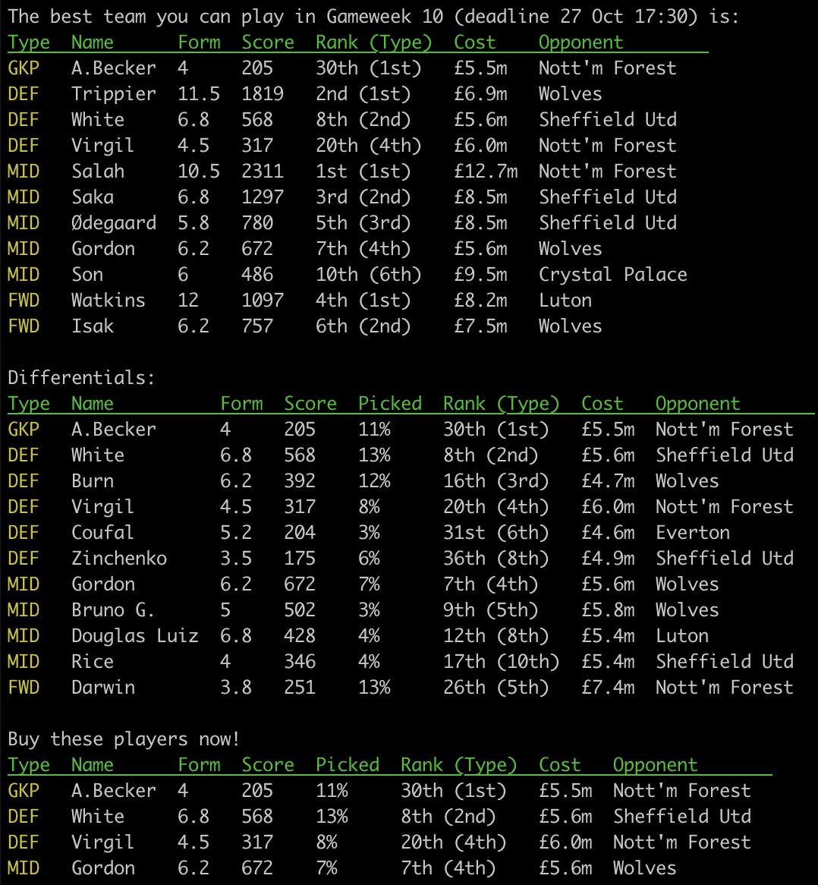
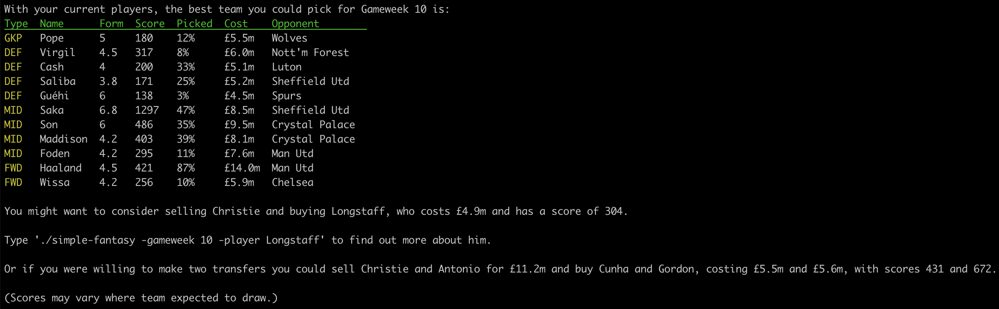

## Simple Fantasy

A very crude tool that lists the "perfect team" for a Premier League fantasy gameweek. It factors in these traits, in the following order:
1) The estimated "difficulty" of the fixture.
2) A player's form.
3) A player's ICT index.
4) A player's average starts.
5) A player's likelihood of playing.

e.g.



### Usage
```
./simple-fantasy -gameweek 10
```

#### Player Detail
```
./simple-fantasy -gameweek 10 -player Haaland
```

#### Config Option
```
./simple-fantasy -gameweek 10 -config ./team.json
```
Create a file in the structure of the one in this repo that represents your current team. The script will tell you what the best team you should play for the gameweek and suggest a replacement for your lowest performing player. Note: Accents and cases must be correct for player surnames.



